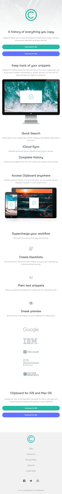
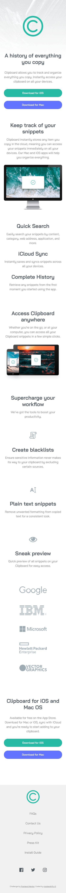

# Frontend Mentor - Clipboard landing page solution

This is a solution to the [Clipboard landing page challenge on Frontend Mentor](https://www.frontendmentor.io/challenges/clipboard-landing-page-5cc9bccd6c4c91111378ecb9).

Frontend Mentor challenges help you improve your coding skills by building realistic projects.

## Table of contents

- [Overview](#overview)
  - [The challenge](#the-challenge)
  - [Screenshot](#screenshot)
  - [Links](#links)
- [My process](#my-process)
  - [Built with](#built-with)
  - [What I learned](#what-i-learned)
  - [Continued development](#continued-development)
  - [Useful resources](#useful-resources)
- [Author](#author)
- [Acknowledgments](#acknowledgments)

## Overview

### The challenge

Users should be able to:

- View the optimal layout for the site depending on their device's screen size
- See hover states for all interactive elements on the page

### Screenshot

### Links

- Solution URL: [Add solution URL here](https://github.com/master-shifu0/clipboard-page-FEM/)
- Live Site URL: [Add live site URL here](https://master-shifu0.github.io/clipboard-page-FEM/)

## My process

### Built with

- Semantic HTML5 markup
- CSS custom properties
- Flexbox
- CSS Grid
- Mobile-first workflow

### What I learned

-I fixed some of the accessibility issues that my last solution had. This makes the website more accessible to people with disabilities  

### Continued development

I think i've had enough of plain html, css and vanilla JS

now i want to learn how to use a framework/library( most likely react)

## Author

- Frontend Mentor - [@yourusername](https://www.frontendmentor.io/profile/mastershifu-0)
- Twitter - [@yourusername](https://www.twitter.com/omobabaijebu)
